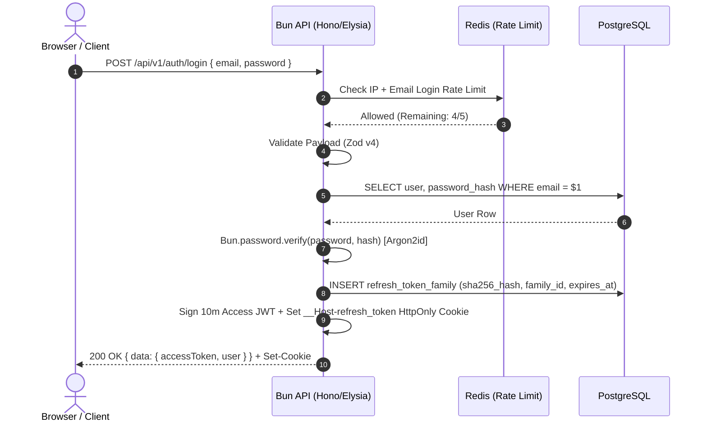
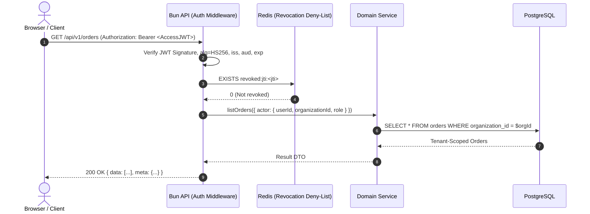
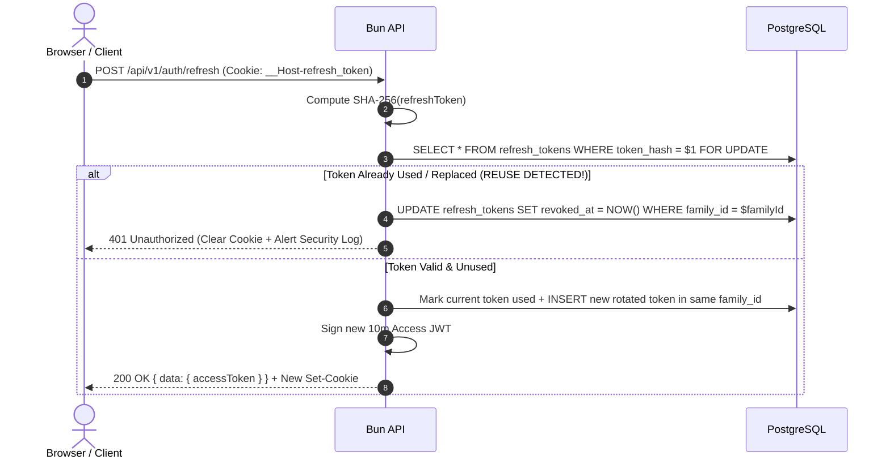
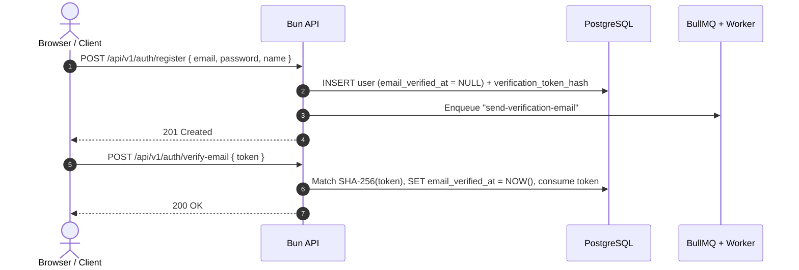
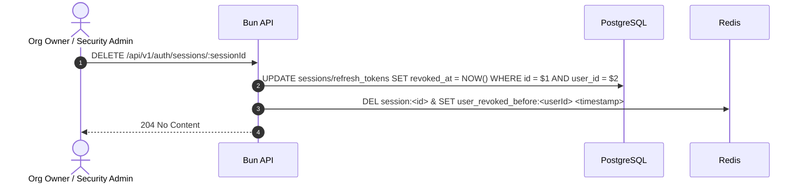

# Module 7 — Production Authentication, Cookie Sessions, JWT Rotation, Sequence Diagrams & CSRF/CORS

> **Course Phase**: Phase 12 (Sections 31–35, 39, 112–113)
> **Verified Primitives**: `Bun.password` (`argon2id`), `WebCrypto` (`crypto.subtle`), `jose`, PostgreSQL + Redis Session Store

---

## 1. Concept: Identity vs Authentication vs Authorization (Section 31)

- **Identity**: *Who* an entity claims to be (`user_id`, `email`, service account ID).
- **Authentication (AuthN)**: *Proving* that identity cryptographically (verifying an Argon2id password hash, an OAuth 2.0 / OIDC authorization code with PKCE, a WebAuthn passkey, or a TOTP MFA code).
- **Session / Token Management**: *Persisting* proof of authentication across stateless HTTP requests via either **Stateful Server-Side Cookie Sessions** or **Short-Lived Signed JWT Access Tokens + Rotated Refresh Tokens**.
- **Authorization (AuthZ)**: *Enforcing* what that authenticated principal can access within a specific tenant boundary (Module 8).

---

## 2. Password Hashing with Native `Bun.password` (Argon2id)

Never use SHA-256, MD5, or unsalted hashes for passwords. Bun provides native **Argon2id** (the OWASP #1 recommended memory-hard password hashing algorithm) via `Bun.password`:

```typescript
// src/modules/auth/password.ts
export async function hashPassword(plainTextPassword: string): Promise<string> {
  // Argon2id resists both GPU cracking (memory-hard) and side-channel attacks
  return await Bun.password.hash(plainTextPassword, {
    algorithm: "argon2id",
    memoryCost: 65536, // 64 MiB
    timeCost: 2,       // 2 iterations
  });
}

export async function verifyPassword(plainTextPassword: string, storedHash: string): Promise<boolean> {
  return await Bun.password.verify(plainTextPassword, storedHash);
}
```

> **Timing-Attack Prevention on Login**: If a user attempts to log in with an email that does not exist in the database, returning `401` in `1ms` (while existing users take `60ms` for Argon2id verification) allows attackers to enumerate registered emails. Always run `await Bun.password.verify(inputPassword, DUMMY_ARGON2ID_HASH)` when the user row is `null` so response timing is constant!

---

## 3. Cookie-Based Sessions vs JWT Architecture (Sections 32–34)

Do **not** claim JWT is universally better than sessions—or vice versa. Understand the exact engineering tradeoffs:

| Dimension | Stateful Cookie Sessions (Redis / PostgreSQL) | Short-Lived JWT Access Token + Rotated Refresh Token |
| :--- | :--- | :--- |
| **How It Works** | Server generates 256-bit random `sessionId`, stores `{ userId, orgId, expiresAt }` in Redis/Postgres (hashed with SHA-256), sends opaque `sessionId` in `HttpOnly` cookie. | Server issues a 5–10 minute signed JWT (`Access Token`) + a 30-day opaque/signed `Refresh Token` stored as a SHA-256 hash in Postgres with a `family_id`. |
| **Immediate Revocation** | **Instant (`O(1)`)**: Delete the session row in Redis/Postgres and the very next request is rejected. | Access token remains valid until its short `exp` (5–10 min) unless checked against a Redis revocation deny-list (`jti`). Refresh token is revoked immediately in DB. |
| **Database / Redis Read per Request** | Requires 1 fast Redis lookup (`<0.5ms`) or Postgres lookup per request; supports sliding expiration (`ttl` extension). | Zero DB/Redis I/O to verify non-revoked Access Token signature via `WebCrypto`/`jose`. |
| **Best Use Case** | First-party web applications (`app.acme.com` talking to `api.acme.com`). | Native mobile apps, CLI tools, third-party API consumers, and multi-service architectures. |

### Cookie Security Attributes (Mandatory in Production — Section 32)

```http
Set-Cookie: __Host-session_token=<opaque-random-token>; Path=/; HttpOnly; Secure; SameSite=Lax; Max-Age=86400
```

- **`__Host-` Prefix**: Instructs the browser that the cookie **must** have `Secure`, **must** have `Path=/`, and **must not** have a `Domain` attribute (preventing subdomain cookie injection attacks!).
- **`HttpOnly`**: Prevents client-side JavaScript (`document.cookie`) from reading the cookie during an XSS attack.
- **`Secure`**: Transmitted **only** over HTTPS (TLS).
- **`SameSite=Lax` (or `Strict`)**: Prevents the cookie from being sent on cross-site `POST`/`PUT`/`DELETE` requests initiated by malicious third-party websites (mitigating CSRF).

---

## 4. Deep JWT Security & Refresh Token Reuse Detection (Sections 33–34)

A JWT consists of `Base64Url(Header).Base64Url(Payload).Base64Url(Signature)`.
- **Payload is Base64Url-encoded, NOT encrypted!** Anyone can decode a JWT payload. Never put secrets, PII, or password hashes inside JWT claims.

### Five Non-Negotiable JWT Security Rules
1. **Explicit Algorithm Whitelisting (Prevent Algorithm Confusion)**:
   - Never let the incoming JWT header dictate verification mode (`alg: "none"` or switching asymmetric `RS256`/`EdDSA` public key into an `HS256` HMAC secret!). Explicitly enforce `algorithms: ["EdDSA"]` or `["HS256"]` in `jwtVerify()`.
2. **Validate `iss` (Issuer), `aud` (Audience), `exp` (Expiration), and `sub` (Subject)** on every verification.
3. **Short Access Token Lifetime**: `5m` to `15m` maximum.
4. **Refresh Token Hashing**: Never store raw refresh tokens in PostgreSQL. Store `SHA-256(refreshToken)` so a read-only SQL leak cannot hijack active sessions.
5. **Refresh Token Rotation & Family Reuse Detection**:
   - Every refresh token belongs to a `family_id` and has a `replaced_by_token_id` pointer.
   - When `/auth/refresh` is called, the used token is marked `revoked_at = NOW()` and a new token in the same `family_id` is issued.
   - **Reuse Detection**: If an already-used refresh token is presented a second time (meaning either an attacker stole the old token or the legitimate user raced with an attacker who already rotated it), **immediately revoke the ENTIRE `family_id`** in PostgreSQL and force re-authentication!

```typescript
// src/modules/auth/jwt.service.ts
import { SignJWT, jwtVerify, type JWTPayload } from "jose";
import { AppError } from "../../errors/app-error";

export interface AccessTokenClaims extends JWTPayload {
  sub: string;            // userId
  org: string;            // active organizationId
  role: "owner" | "admin" | "manager" | "member";
  jti: string;            // unique token ID for optional Redis blacklisting
}

export class JwtService {
  private readonly secretKey: Uint8Array;
  private readonly issuer = "https://api.acme-commerce.com";
  private readonly audience = "https://app.acme-commerce.com";

  constructor(rawSecret: string) {
    if (rawSecret.length < 32) {
      throw new Error("JWT_SECRET must be at least 32 bytes of high entropy");
    }
    this.secretKey = new TextEncoder().encode(rawSecret);
  }

  async signAccessToken(claims: {
    userId: string;
    organizationId: string;
    role: AccessTokenClaims["role"];
  }): Promise<string> {
    return await new SignJWT({
      org: claims.organizationId,
      role: claims.role,
    })
      .setProtectedHeader({ alg: "HS256", typ: "JWT" })
      .setSubject(claims.userId)
      .setJti(Bun.randomUUIDv7())
      .setIssuer(this.issuer)
      .setAudience(this.audience)
      .setIssuedAt()
      .setExpirationTime("10m") // Strict 10-minute lifetime
      .sign(this.secretKey);
  }

  async verifyAccessToken(token: string): Promise<AccessTokenClaims> {
    try {
      const { payload } = await jwtVerify(token, this.secretKey, {
        algorithms: ["HS256"], // Explicit whitelist prevents algorithm confusion!
        issuer: this.issuer,
        audience: this.audience,
        clockTolerance: 5,
      });
      return payload as AccessTokenClaims;
    } catch (err) {
      throw AppError.unauthorized("Invalid or expired access token");
    }
  }
}
```

---

## 5. Auth Sequence Diagrams (Section 35 & Sections 112–113)

### 5.1 LOGIN FLOW


### 5.2 AUTHENTICATED REQUEST FLOW


### 5.3 REFRESH TOKEN ROTATION & REUSE DETECTION FLOW


### 5.4 LOGOUT FLOW
```mermaid
sequenceDiagram
    autonumber
    actor Client as Browser / Client
    participant API as Bun API
    participant Redis as Redis
    participant DB as PostgreSQL

    Client->>API: POST /api/v1/auth/logout (Bearer JWT + Refresh Cookie)
    API->>DB: UPDATE refresh_tokens SET revoked_at = NOW() WHERE family_id = $familyId
    API->>Redis: SET revoked:jti:<accessJti> "1" EX <remainingJwtTtlSeconds>
    API-->>Client: 204 No Content (Set-Cookie: __Host-refresh_token=""; Max-Age=0)
```

### 5.5 PASSWORD RESET FLOW
```mermaid
sequenceDiagram
    autonumber
    actor Client as Browser / Client
    participant API as Bun API
    participant DB as PostgreSQL
    participant Queue as BullMQ + Worker
    participant Email as Email Provider

    Client->>API: POST /api/v1/auth/forgot-password { email }
    API->>DB: Lookup user; store SHA-256(resetToken) with 15m expiry
    API->>Queue: Enqueue "send-password-reset-email" job
    API-->>Client: 202 Accepted (Generic message: never leak whether email exists!)
    Queue->>Email: Send Reset Link with raw token
    Client->>API: POST /api/v1/auth/reset-password { token, newPassword }
    API->>DB: Verify SHA-256(token) unconsumed & unexpired; UPDATE password_hash (Argon2id); REVOKE ALL user sessions/refresh families
    API-->>Client: 200 OK
```

### 5.6 EMAIL VERIFICATION FLOW


### 5.7 SESSION REVOCATION FLOW (ADMIN OR SECURITY EVENT)


---

## 6. Deep Dive: CSRF vs CORS vs Cookie Authentication (Section 39)

1. **What CORS Actually Does**:
   - Cross-Origin Resource Sharing (`Access-Control-Allow-Origin`) tells a **Web Browser** whether JavaScript running on `https://evil.com` is allowed to read responses from `https://api.acme.com`.
   - **CRITICAL SECURITY TRUTH**: **CORS does NOT protect your API from non-browser clients** (`curl`, Postman, Python scripts, or an attacker's backend server). Non-browser clients ignore CORS completely. Never treat CORS as authentication or authorization!
2. **What CSRF (Cross-Site Request Forgery) Actually Is**:
   - When authentication relies purely on ambient cookies (`Cookie: session=...`), a malicious page on `https://evil.com` can submit a hidden `<form action="https://api.acme.com/api/v1/orders" method="POST">` and the user's browser may automatically attach their cookies if `SameSite=None` or on top-level navigation.
3. **How to Defend Cookie-Authenticated Endpoints Against CSRF**:
   - Set `SameSite=Lax` (or `Strict`) + `Secure` + `HttpOnly`.
   - Validate the `Origin` / `Referer` header on all state-mutating methods (`POST`, `PUT`, `PATCH`, `DELETE`) using Hono's `csrf({ origin: ["https://app.acme.com"] })` middleware (note: Hono `v4.13.10` properly exempts `OPTIONS` preflight requests).
   - Require `Content-Type: application/json` (HTML `<form>` elements cannot send `application/json` without triggering a CORS preflight check).

---

## 7. Exercises & Architecture Challenge

- **Beginner**: Implement a constant-time login handler using `Bun.password.verify` that executes a dummy Argon2id verification when an email is not found in PostgreSQL.
- **Intermediate**: Implement Refresh Token Family Reuse Detection in PostgreSQL + Drizzle and write a `bun:test` test proving that replaying a rotated refresh token revokes the newly issued token as well.
- **Architecture Challenge**: *You have 3 Bun API instances behind a load balancer. A user clicks "Revoke All My Sessions" after losing their laptop, but their stolen Access JWT still has 8 minutes before `exp`. How do you guarantee that all 3 Bun instances reject that JWT within 50 milliseconds without querying PostgreSQL on every request?* (Answer: Store a `user_tokens_valid_after:<userId>` unix timestamp in Redis with a 10-minute TTL—or push the `jti` to a Redis set—and check it in the JWT middleware).
